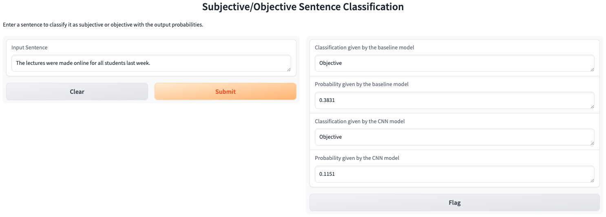

# sub-obj-classifier

## Introduction
Subjective / Objective Statement Classifier is a tool that uses language models in NLP to determine if a particular statement (a sentence) is subjective or objective.

## Acknowledgement
This project was built with the guidance from Prof. Jonathan Rose's NLP course in 2024, which also includes the original dataset <data.tsv> used in the Interactive Python Notebook files.

## Instructions
1. To launch the Gradio user interface, your will first need two checkpoint files (`<baseline.pt>` and `<cnn.pt>`) that save the trained model parameters.
2. Once you have all required Python libraries installed, run `python main_gradio.py` in your terminal and follow the instructions it gives to open up the URL (`http://127.0.0.1:7860` by default) in your browser.
3. Put a sentence or paragraph in the input textbox and run the language models to give you their classification results.

## Objectives
Earlier this year (July 2024), I did some research on using NLP to skim through the news articles to build investment strategies on the stock market (as shown on my website). A few questions that came up in my mind almost immediately are:

1. How do I know if the information in online articles is correctly and accurately reflects the facts?
2. Would it be helpful to have a tool that helps us examine an article is trustworthy especially in the big information era when people get to post their opinions on social media?
3. What would be an efficient way to determine whether an article is trustworthy or not?

The third question eventually motivated me to build a helper tool that classifies a piece of text to "subjective" or "objective," and I believe its classification results would make it easier to filter the massive information before directly using it for any analytical tasks.